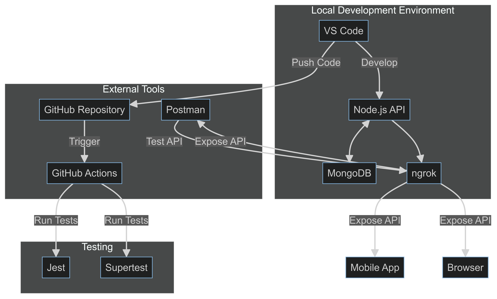

# Husna App Backend

This repository contains the backend API for the Husna App, a platform designed to connect Muslims through live discussions, classes, events, and prayer time notifications.

## Pre-Deployment Architecture

Our current development setup is illustrated in the following diagram:



## Project Overview

The Husna App backend is built with Node.js and Express, using MongoDB as the database. It provides API endpoints for various features including user management, live voice rooms (Circles), classes, events, and prayer times.

### Key Features

- User authentication and authorization
- Live voice rooms (Circles)
- Classes and Events management
- Prayer time calculations and notifications
- Document verification for Instructors and Institutions
- Search functionality
- Payment integration for donations and paid classes

## Getting Started

### Prerequisites

- Node.js (v14 or later)
- MongoDB
- ngrok (for local development)
- Postman (for API testing)

### Installation

1. Clone the repository:
   ```
   git clone https://github.com/yourusername/husna-app-backend.git
   ```

2. Install dependencies:
   ```
   cd husna-app-backend
   npm install
   ```

3. Set up environment variables:
   ```
   cp .env.example .env
   ```
   Edit the `.env` file with your configuration.

4. Start the development server:
   ```
   npm run dev
   ```

5. (Optional) Start ngrok to expose your local server:
   ```
   ngrok http 3000
   ```

## Development Workflow

1. Create a new branch for each feature or bug fix.
2. Write tests for new features using Jest and Supertest.
3. Implement the feature or fix.
4. Run tests locally: `npm test`
5. Push your branch and create a pull request.
6. GitHub Actions will run automated tests on your pull request.
7. After review and approval, merge your changes into the main branch.

## API Documentation

API documentation is available via Postman. Import the Postman collection from the `docs` folder for a complete list of endpoints and example requests.

## Contributing

Please read [CONTRIBUTING.md](CONTRIBUTING.md) for details on our code of conduct and the process for submitting pull requests.

## License

This project is licensed under the MIT License - see the [LICENSE.md](LICENSE.md) file for details.